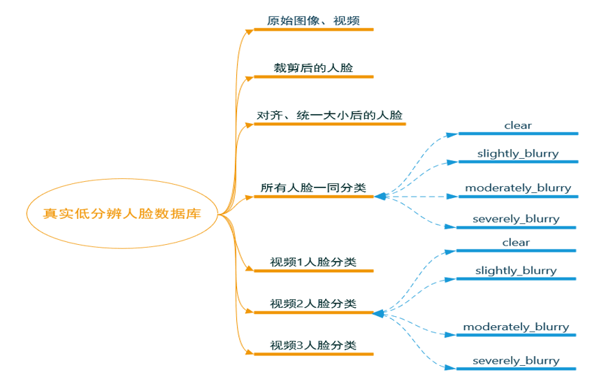

# FSRDATASET
该数据集是一个用于评估人脸超分辨算法的真实人脸低分辨数据集，旨在为研究人员提供一个公开的数据集和基准评估结果，以促进人脸超分辨领域的研究和发展。
## 来源和大小
数据集的构建过程中要注重数据的安全和保密，以确保人脸的隐私得到保护，同时研究要求收集到的图像具有自然、未经处理、低分辨率的特点。考虑到以上两点，研究决定从两种渠道获取人脸图像：

a．	寻找自愿提供人脸图像志愿者，获取他们的人脸图片

b.	通过公开的、广泛传播的图片、视频获取其中的人脸图像

目前，通过上述两种渠道共获取了原始图像80余张，可用于获取人脸的视频约132分钟，视频主要以体育赛事直播回放为主，该类视频的观众席不仅可以提供大量的自然低分辨的人脸图像，还保证了人脸图像未经处理与加工，人脸的真实性有保障。在获得上述原始数据后，我们对其进行了人脸检测、裁剪、对齐、大小统一等操作,为使数据集清晰、有条理，也为了便于后续对人脸超分辨算法进行评估，研究将每张人脸图像按照模糊程度进行分类，分为清晰、轻度模糊、中度模糊和重度模糊四类。数据集包括获得的原始图像与视频、人脸裁剪识别后的原始图像、经过对齐统一大小的图像、按模糊程度对所有图像进行分类的结果、按模糊程度与获取来源分类的结果，结构如图:

### 部分本地图片展示

下面是我们数据集中的一些示例图片：

